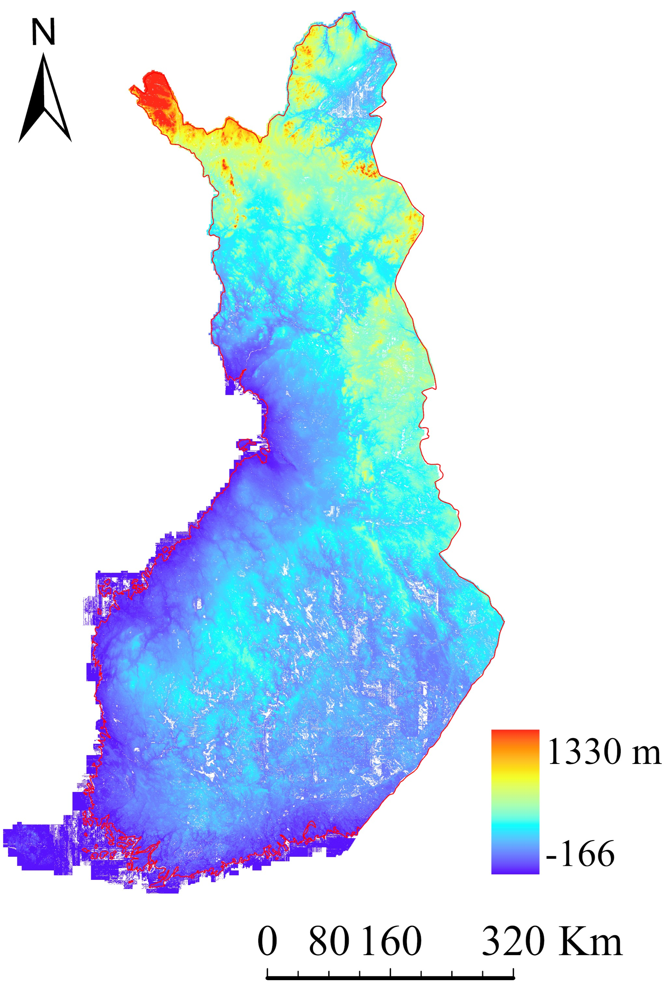
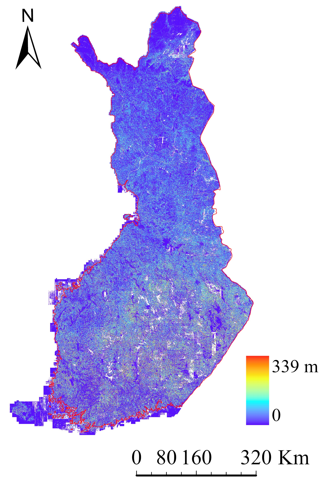

# FinTopo2 - A 2-Meter High-Res Terrain Dataset in Finland
**Authors:** Xu Wang, Xinlian Liang, Weishu Gong, Pasi Häkli, Yunsheng Wang 
## 1.Introduction
<div align="justify">
FinTopo2 is an open-access, high-resolution terrain dataset covering all of Finland with a 2-meter spatial resolution. It includes a Digital Elevation Model (DEM), a Digital Surface Model (DSM), and a normalized Digital Surface Model (nDSM), offering detailed and accurate topographic information for various applications, such as geographic and environmental research, urban planning, and more. Derived from open-source airborne laser scanning (ALS) point cloud data provided by the National Land Survey of Finland (NLS, https://www.maanmittauslaitos.fi/en/e-services/open-data-file-download-service), FinTopo2 uses the ETRS89 / TM35FIN (E, N) coordinate reference system (EPSG:3067) and the N2000 height system (EPSG:3900). The illustration of FinTopo2 dataset is shown in Figure 1.<br><br>
</div>
<p align="center">
  
  
  
</p>
&nbsp;&nbsp;&nbsp;&nbsp;&nbsp;&nbsp;&nbsp;&nbsp;&nbsp;&nbsp;&nbsp;&nbsp;&nbsp;&nbsp;&nbsp;&nbsp;&nbsp;&nbsp;&nbsp;&nbsp;&nbsp;&nbsp;&nbsp;&nbsp;&nbsp;&nbsp;&nbsp;&nbsp;&nbsp;&nbsp;&nbsp;&nbsp;&nbsp;&nbsp;&nbsp;(a) &nbsp;&nbsp;&nbsp;&nbsp;&nbsp;&nbsp;&nbsp;&nbsp;&nbsp;&nbsp;&nbsp;&nbsp;&nbsp;&nbsp;&nbsp;&nbsp;&nbsp;&nbsp;&nbsp;&nbsp;&nbsp;&nbsp;&nbsp;&nbsp;&nbsp;&nbsp;&nbsp;&nbsp;&nbsp;&nbsp;&nbsp;&nbsp;&nbsp;&nbsp;&nbsp;&nbsp;&nbsp;&nbsp;&nbsp;&nbsp;&nbsp;&nbsp;&nbsp;&nbsp;&nbsp;&nbsp;&nbsp;&nbsp;&nbsp;&nbsp;&nbsp;&nbsp;&nbsp;&nbsp;&nbsp;&nbsp;&nbsp;&nbsp;&nbsp;&nbsp;&nbsp;&nbsp;&nbsp;&nbsp;&nbsp;&nbsp;&nbsp;&nbsp;&nbsp;&nbsp;(b) &nbsp;&nbsp;&nbsp;&nbsp;&nbsp;&nbsp;&nbsp;&nbsp;&nbsp;&nbsp;&nbsp;&nbsp;&nbsp;&nbsp;&nbsp;&nbsp;&nbsp;&nbsp;&nbsp;&nbsp;&nbsp;&nbsp;&nbsp;&nbsp;&nbsp;&nbsp;&nbsp;&nbsp;&nbsp;&nbsp;&nbsp;&nbsp;&nbsp;&nbsp;&nbsp;&nbsp;&nbsp;&nbsp;&nbsp;&nbsp;&nbsp;&nbsp;&nbsp;&nbsp;&nbsp;&nbsp;&nbsp;&nbsp;&nbsp;&nbsp;&nbsp;&nbsp;&nbsp;&nbsp;&nbsp;&nbsp;&nbsp;&nbsp;&nbsp;&nbsp;&nbsp;&nbsp;&nbsp;&nbsp;&nbsp;&nbsp;&nbsp;&nbsp;&nbsp;&nbsp;(c)
<div align="justify">
Figure 1. An illustration of the FinTopo2 dataset. (a) is DEM; (b) is DSM; (c) is nDSM.<br><br>
</div>
<div align="justify">
This documentation provides detailed descriptions about the dataset to facilitate efficient and effective data usage. More detailed information and demonstrative use cases of the dataset are provided in the following paper. The paper is regarded as a license, and the users are required to cite the paper to specify the data source.<br><br>
</div>
<div align="justify">
Wang, X., Liang, X., Gong, W., Häkli, P., Wang, Y., 2024. Accuracy Fluctuations of ICESat-2 Height Measurements in Time Series. International Journal of Applied Earth Observations and Geoinformation. https://doi.org/10.1016/j.jag.2024.104234. (Early Accept)<br><br>
</div>
<div align="justify">
We invite researchers, developers, and anyone interested in geospatial information to utilize and explore the FinTopo2 dataset, providing robust data support for scientific research, spatial planning, and application development.<br><br>
</div>

## 2.Naming Convention
Dataset files utilize the following naming convention:<br><br>
xxxxxxxTTT.tif<br><br>
For example:<br><br>
k2444f1DEM.tif / k2444f1DSM.tif / k2444f1CHM.tif<br><br>
The file naming convention variables is described in Table 1:
<div align="justify">
Table 1. File naming convention variables and descriptions.
</div>

| Variable | Description |
|------|------|
| xxxxxxx | Adopting the original ALS data file naming structure.|
|TTT| Type of terrain product, including DEM, DSM, and nDSM (CHM).|

## 3.Example Code
<div align="justify">
We recommend using the geotiffread or readgeoraster functions in MATLAB to read the .tif images in the dataset. The function usage is as follows:<br><br>
</div>

```matlab
[A, R] = geotiffread(‘yourfile.tif’);
[A, R] = readgeoraster(‘yourfile.tif’);
```

<div align="justify">
A: contains the image data as a matrix.<br><br>
</div>
<div align="justify">
R: returns the spatial referencing object for georeferencing the data.<br><br>
</div>
<div align="justify">
yourfile.tif: path to the GeoTIFF file.<br><br>
</div>

## 4.Data Link
<div align="justify">
Due to the large size of the FinTopo2 dataset (approximately 630 GB), we are in the process of uploading it to a data hosting server. The download link will be available soon.<br><br>
</div>

## 5.Usage
<div align="justify">
FinTopo2 is an open-access dataset under the license CC BY 4.0.<br><br>
</div>

